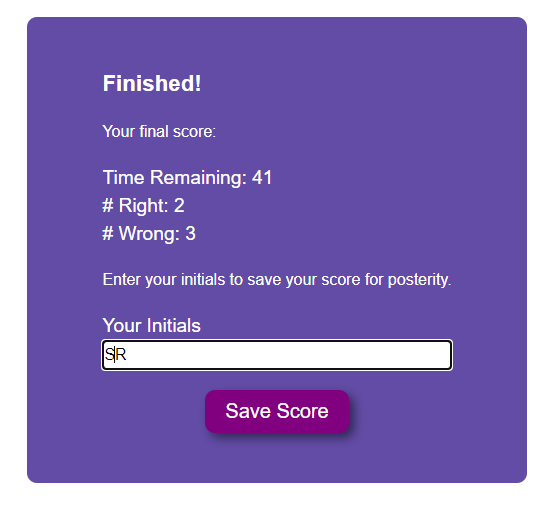
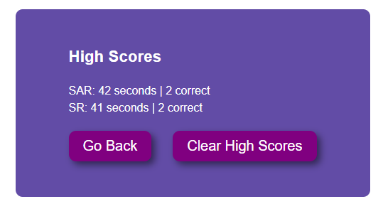

# Code Quiz

## Table of Contents
- [Project Overview](#project-overview)
- [Live Application](#live-application)
- [License](#license)
- [Screenshots](#screenshots)

## Project Overview
Code Quiz 1.1 buildout. Developer created single-window application to serve quiz questions on JavaScript for user to answer and then view final score and finish time against previous attempts by same user. 

Code Quiz uses a series of function calls to serve different screens that display quiz questions and related information, which are chained together by event listeners based on user inputs. Quiz questions and answers are dynamically served by startGame() function, which pulls content from questionLibrary and populates the index.html file. The function then verifies whether user selected answers are true or false before populating final score record for user to add initials to, which is then pushed to localStorage. Quiz is also timed using setInterval method with a secondary screen displaying if user runs out of time before finishing (which is also timed with setInterval before reverting to main finish screen). Developer leveraged array in localStorage to store final scores between sessions until user manually clears them in application or clears in browser.

Code Quiz is rounded out with streamlined CSS for a cleaner and more inuitive interface, including responsive features built into the main styles and minimal media queries.

### Technologies Used:
- JavaScript
- CSS
- HTML

## Live Application
https://captain63.github.io/code-quiz/

## License
Permission is hereby granted, free of charge, to any person obtaining a copy of this Software and associated documentation files (the "Software"), to deal in the Software without  restriction, including without limitation the rights to use, copy, modify, merge, publish distribute, sublicense, and/or sell copies of the Software, and to permit persons to whom the Software is furnished to do so, subject to the following conditions.

[View the full license](./LICENSE).

## Screenshots

